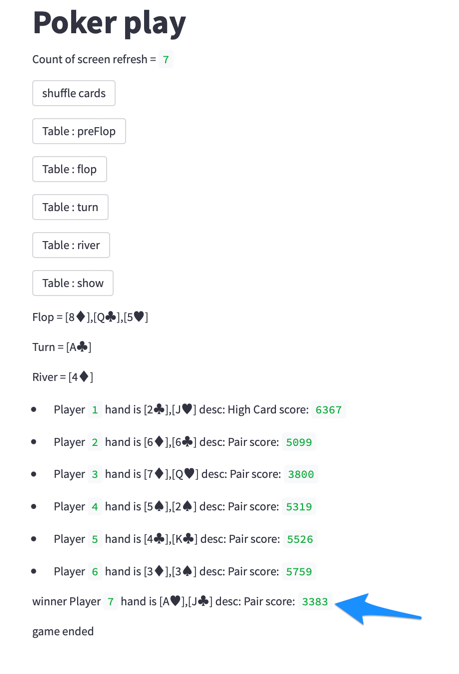

# streamlit-poker-game

streamLit based poker game

# Credits

## Treys python package

https://github.com/ihendley/treys

## StreamLit - statefull webapp

https://blog.streamlit.io/session-state-for-streamlit/

# Screenshot

# This is still in the works,

I have to add

* Poker table
* Avatars for the players
  - provide personalities for each player
* except for the user - all other players will be bots
* enable 1 or 2 bots to cheat by
  - peeking at each other cards
  - peeking into the pre-flop / pre-turn / pre-river / deck

non goals

* the game will never be biased and deal favorably for a player

advanced goals

* embed decision/ rules matrix to define personalities
* experiment with AI (a fun way to learn)
